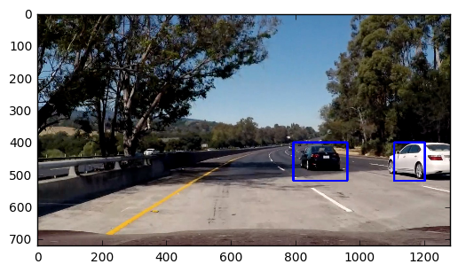

# LORENZO STECCANELLA P5 Report

## Import all the library needed for the project


```python
import matplotlib.image as mpimg
import matplotlib.pyplot as plt
import numpy as np
import cv2
import glob
import time
from sklearn.svm import LinearSVC
from sklearn.preprocessing import StandardScaler
# NOTE: the next import is only valid 
# for scikit-learn version <= 0.17
# if you are using scikit-learn >= 0.18 then use this:
# from sklearn.model_selection import train_test_split
from sklearn.cross_validation import train_test_split
from skimage.feature import hog
```

    /home/lorenzo/miniconda3/envs/carnd-term1/lib/python3.5/site-packages/sklearn/cross_validation.py:44: DeprecationWarning: This module was deprecated in version 0.18 in favor of the model_selection module into which all the refactored classes and functions are moved. Also note that the interface of the new CV iterators are different from that of this module. This module will be removed in 0.20.
      "This module will be removed in 0.20.", DeprecationWarning)


# make the dataset easyer by renaming and moving all the images in a unique folder


```python
images = glob.glob('vehicles/vehicles/GTI_Far/*.png')
indexCar=0
for image in images:
    car_image = mpimg.imread(image)
    mpimg.imsave('ALL_images/Car/car_Far'+str(indexCar),car_image)
    indexCar+=1
images = glob.glob('vehicles/Car/vehicles/GTI_Left/*.png')    
for image in images:
    car_image = mpimg.imread(image)
    mpimg.imsave('ALL_images/Car/car_Left'+str(indexCar),car_image)
    indexCar+=1
images = glob.glob('vehicles/vehicles/GTI_MiddleClose/*.png')    
for image in images:
    car_image = mpimg.imread(image)
    mpimg.imsave('ALL_images/Car/car_MiddleClose'+str(indexCar),car_image)
    indexCar+=1
images = glob.glob('vehicles/vehicles/GTI_Right/*.png')    
for image in images:
    car_image = mpimg.imread(image)
    mpimg.imsave('ALL_images/Car/car_Right'+str(indexCar),car_image)
    indexCar+=1
images = glob.glob('vehicles/vehicles/KITTI_extracted/*.png')    
for image in images:
    car_image = mpimg.imread(image)
    mpimg.imsave('ALL_images/Car/car_KITTI'+str(indexCar),car_image)
    indexCar+=1
```


```python
cars = []
notcars = []
images_car = glob.glob('ALL_images/Car/*.png')
images_not_car = glob.glob('ALL_images/Not-Car/*.png')
for image in images_car:
    cars.append(image)
for image in images_not_car:
    notcars.append(image)
    
for i in range(5):
    img = mpimg.imread(cars[i])
    plt.imshow(img)
    plt.show()
    img = mpimg.imread(notcars[i])
    plt.imshow(img)
    plt.show()
```


# define some usefull function for the feature extraction


```python
def convert_color(img, conv='RGB2YCrCb'):
    if conv == 'RGB2YCrCb':
        return cv2.cvtColor(img, cv2.COLOR_RGB2YCrCb)
    if conv == 'BGR2YCrCb':
        return cv2.cvtColor(img, cv2.COLOR_BGR2YCrCb)
    if conv == 'RGB2LUV':
        return cv2.cvtColor(img, cv2.COLOR_RGB2LUV)

def get_hog_features(img, orient, pix_per_cell, cell_per_block, 
                        vis=False, feature_vec=True):
    # Call with two outputs if vis==True
    if vis == True:
        features, hog_image = hog(img, orientations=orient, 
                                  pixels_per_cell=(pix_per_cell, pix_per_cell),
                                  cells_per_block=(cell_per_block, cell_per_block), 
                                  transform_sqrt=False, 
                                  visualise=vis, feature_vector=feature_vec)
        return features, hog_image
    # Otherwise call with one output
    else:      
        features = hog(img, orientations=orient, 
                       pixels_per_cell=(pix_per_cell, pix_per_cell),
                       cells_per_block=(cell_per_block, cell_per_block), 
                       transform_sqrt=False, 
                       visualise=vis, feature_vector=feature_vec)
        return features

def bin_spatial(img, size=(32, 32)):
    color1 = cv2.resize(img[:,:,0], size).ravel()
    color2 = cv2.resize(img[:,:,1], size).ravel()
    color3 = cv2.resize(img[:,:,2], size).ravel()
    return np.hstack((color1, color2, color3))
                        
def color_hist(img, nbins=32):    #bins_range=(0, 256)
    # Compute the histogram of the color channels separately
    channel1_hist = np.histogram(img[:,:,0], bins=nbins)
    channel2_hist = np.histogram(img[:,:,1], bins=nbins)
    channel3_hist = np.histogram(img[:,:,2], bins=nbins)
    # Concatenate the histograms into a single feature vector
    hist_features = np.concatenate((channel1_hist[0], channel2_hist[0], channel3_hist[0]))
    # Return the individual histograms, bin_centers and feature vector
    return hist_features
```

# test the features on a test image, and not on the dataset images

The feature selected for this projects are:
    - First compute the convert color from RGB to YCrCb
    - Extract the hog feature for each color channel (0,1,2) with a bins of 32
    - bin_spatial the image to 32 x 32
    - Apply a color_hist with nbins=32
    - Concatenate the features extracted for hog, color hist, bin_spatial
    - return all the features


```python

img = mpimg.imread('test_images/test5.jpg')
plt.imshow(img)
plt.show()
car_img_area=img[400:500,800:950]
not_car_img_area=img[400:500,400:550]
car_img_area= cv2.resize(car_img_area, (64,64), interpolation = cv2.INTER_CUBIC)
not_car_img_area=cv2.resize(not_car_img_area, (64,64), interpolation = cv2.INTER_CUBIC)
plt.imshow(car_img_area)
plt.show()
plt.imshow(not_car_img_area)
plt.show()
car_conv_color_img=convert_color(car_img_area,'RGB2YCrCb')
not_car_conv_color_img=convert_color(not_car_img_area,'RGB2YCrCb')
plt.imshow(car_conv_color_img)
plt.show()
plt.imshow(not_car_conv_color_img)
plt.show()

orient = 9
pix_per_cell = 8
cell_per_block = 2
spatial_size=(32, 32)
hist_bins=32

ch1 = car_conv_color_img[:,:,0]
ch2 = car_conv_color_img[:,:,1]
ch3 = car_conv_color_img[:,:,2]
hogimg1,hog1 = get_hog_features(ch1, orient, pix_per_cell, cell_per_block,True, feature_vec=False)
hogimg2,hog2 = get_hog_features(ch2, orient, pix_per_cell, cell_per_block,True, feature_vec=False)
hogimg3,hog3 = get_hog_features(ch3, orient, pix_per_cell, cell_per_block,True, feature_vec=False)
hog_feat1 = hog1.ravel() 
hog_feat2 = hog2.ravel() 
hog_feat3 = hog3.ravel() 
hog_features = np.hstack((hog_feat1, hog_feat2, hog_feat3))
spatial_features = bin_spatial(car_conv_color_img, size=spatial_size)
# Compute the histogram of the color channels separately
channel1_hist = np.histogram(car_conv_color_img[:,:,0], bins=hist_bins)
channel2_hist = np.histogram(car_conv_color_img[:,:,1], bins=hist_bins)
channel3_hist = np.histogram(car_conv_color_img[:,:,2], bins=hist_bins)
# Concatenate the histograms into a single feature vector
hist_features = np.concatenate((channel1_hist[0], channel2_hist[0], channel3_hist[0]))
features=(np.concatenate((spatial_features, hist_features, hog_features)))
bin=np.arange(0.1,5,0.1)
plt.hist(features,bins=bin)
plt.show()

ch1 = not_car_conv_color_img[:,:,0]
ch2 = not_car_conv_color_img[:,:,1]
ch3 = not_car_conv_color_img[:,:,2]
hogimg1,hog1 = get_hog_features(ch1, orient, pix_per_cell, cell_per_block,True, feature_vec=False)
hogimg2,hog2 = get_hog_features(ch2, orient, pix_per_cell, cell_per_block,True, feature_vec=False)
hogimg3,hog3 = get_hog_features(ch3, orient, pix_per_cell, cell_per_block,True, feature_vec=False)
hog_feat1 = hog1.ravel() 
hog_feat2 = hog2.ravel() 
hog_feat3 = hog3.ravel() 
hog_features = np.hstack((hog_feat1, hog_feat2, hog_feat3))
spatial_features = bin_spatial(not_car_conv_color_img, size=spatial_size)
# Compute the histogram of the color channels separately
channel1_hist = np.histogram(not_car_conv_color_img[:,:,0], bins=hist_bins)
channel2_hist = np.histogram(not_car_conv_color_img[:,:,1], bins=hist_bins)
channel3_hist = np.histogram(not_car_conv_color_img[:,:,2], bins=hist_bins)
# Concatenate the histograms into a single feature vector
hist_features = np.concatenate((channel1_hist[0], channel2_hist[0], channel3_hist[0]))
features=(np.concatenate((spatial_features, hist_features, hog_features)))
bin=np.arange(0.1,5,0.1)
plt.hist(features,bins=bin)
plt.show()
```


# train and test the SVM classifier

For this project an SVM classifier has been implemented, since the classes are just two and spatially separated this classifier I think can perform at best. The dataset has been splitted for the 80% to Training set and 20% to Test set. The label has been created having 1 for indicating images with a car and 0 for images without a car. The performance of the classifier on the test set are: 0.9938


```python
def extract_features(imgs,orient, pix_per_cell, cell_per_block, spatial_size, hist_bins):
    features = []
    # Iterate through the list of images
    for file in imgs:
        # Read in each one by one
        img = mpimg.imread(file)
        ctrans_tosearch = convert_color(img, conv='RGB2YCrCb')
        ch1 = ctrans_tosearch[:,:,0]
        ch2 = ctrans_tosearch[:,:,1]
        ch3 = ctrans_tosearch[:,:,2]
        hog1 = get_hog_features(ch1, orient, pix_per_cell, cell_per_block, feature_vec=False)
        hog2 = get_hog_features(ch2, orient, pix_per_cell, cell_per_block, feature_vec=False)
        hog3 = get_hog_features(ch3, orient, pix_per_cell, cell_per_block, feature_vec=False)
        hog_feat1 = hog1.ravel() 
        hog_feat2 = hog2.ravel() 
        hog_feat3 = hog3.ravel() 
        hog_features = np.hstack((hog_feat1, hog_feat2, hog_feat3))
        spatial_features = bin_spatial(ctrans_tosearch, size=spatial_size)
        hist_features = color_hist(ctrans_tosearch, nbins=hist_bins)
        features.append(np.concatenate((spatial_features, hist_features, hog_features)))
    return features

orient = 9
pix_per_cell = 8
cell_per_block = 2
spatial_size=(32, 32)
hist_bins=32
cars = []
notcars = []
images_car = glob.glob('ALL_images/Car/*.png')
images_not_car = glob.glob('ALL_images/Not-Car/*.png')
for image in images_car:
    cars.append(image)
for image in images_not_car:
    notcars.append(image)

print("number of car images: ", len(cars))
print("number of non car images: ", len(notcars))

t=time.time()
car_features = extract_features(cars,orient, pix_per_cell, cell_per_block, spatial_size, hist_bins)
notcar_features = extract_features(notcars,orient, pix_per_cell, cell_per_block, spatial_size, hist_bins)
t2=time.time()
print(round(t2-t, 2), 'Seconds to extract HOG features...')
# Create an array stack of feature vectors
X = np.vstack((car_features, notcar_features)).astype(np.float64)                        
# Fit a per-column scaler
X_scaler = StandardScaler().fit(X)
# Apply the scaler to X
scaled_X = X_scaler.transform(X)
# Define the labels vector
y = np.hstack((np.ones(len(car_features)), np.zeros(len(notcar_features))))


# Split up data into randomized training and test sets
rand_state = np.random.randint(0, 100)
X_train, X_test, y_train, y_test = train_test_split(
    scaled_X, y, test_size=0.2, random_state=rand_state)

print('Using:',orient,'orientations',pix_per_cell,
    'pixels per cell and', cell_per_block,'cells per block')
print('Feature vector length:', len(X_train[0]))
# Use a linear SVC 
svc = LinearSVC()
# Check the training time for the SVC
t=time.time()
svc.fit(X_train, y_train)
t2 = time.time()
print(round(t2-t, 2), 'Seconds to train SVC...')
print('Test Accuracy of SVC = ', round(svc.score(X_test, y_test), 4))
# Check the prediction time for a single sample
t=time.time()
n_predict = len(X_test)
print('My SVC predicts: ', svc.predict(X_test[0:n_predict]))
print('For these',n_predict, 'labels: ', y_test[0:n_predict])
t2 = time.time()
print(round(t2-t, 5), 'Seconds to predict', n_predict,'labels with SVC')
```

    number of car images:  7883
    number of non car images:  8967
    212.95 Seconds to extract HOG features...
    Using: 9 orientations 8 pixels per cell and 2 cells per block
    Feature vector length: 8460
    29.61 Seconds to train SVC...
    Test Accuracy of SVC =  0.9935
    My SVC predicts:  [ 0.  0.  0. ...,  1.  0.  0.]
    For these 3370 labels:  [ 0.  0.  0. ...,  1.  0.  0.]
    0.02075 Seconds to predict 3370 labels with SVC


# define a moving window and use the SVM classifier prediction to see where are located the car in the full image 

In order to locate the car in a image a moving window has been used. This moving window is not applayed to all the region of the image but just for the area from y=400 to y=656 that is the area realeted to the road. Each window box has been used with the svm to predict if it contains a car or not. This approach create multiple overlapping window that are usefull in the next step and the SVM create also some False positive.


```python
img = mpimg.imread('test_images/test5.jpg')

# Define a single function that can extract features using hog sub-sampling and make predictions
def find_cars(img, ystart, ystop, scale, svc, X_scaler, orient, pix_per_cell, cell_per_block, spatial_size, hist_bins):
    
    rectangles=[]
    draw_img = np.copy(img)
    img = img.astype(np.float32)/255
    
    img_tosearch = img[ystart:ystop,:,:]
    ctrans_tosearch = convert_color(img_tosearch, conv='RGB2YCrCb')
    if scale != 1:
        imshape = ctrans_tosearch.shape
        ctrans_tosearch = cv2.resize(ctrans_tosearch, (np.int(imshape[1]/scale), np.int(imshape[0]/scale)))
        
    ch1 = ctrans_tosearch[:,:,0]
    ch2 = ctrans_tosearch[:,:,1]
    ch3 = ctrans_tosearch[:,:,2]

    # Define blocks and steps as above
    nxblocks = (ch1.shape[1] // pix_per_cell)-1
    nyblocks = (ch1.shape[0] // pix_per_cell)-1 
    nfeat_per_block = orient*cell_per_block**2
    # 64 was the orginal sampling rate, with 8 cells and 8 pix per cell
    window = 64
    nblocks_per_window = (window // pix_per_cell)-1 
    cells_per_step = 2  # Instead of overlap, define how many cells to step
    nxsteps = (nxblocks - nblocks_per_window) // cells_per_step
    nysteps = (nyblocks - nblocks_per_window) // cells_per_step
    
    # Compute individual channel HOG features for the entire image
    hog1 = get_hog_features(ch1, orient, pix_per_cell, cell_per_block, feature_vec=False)
    hog2 = get_hog_features(ch2, orient, pix_per_cell, cell_per_block, feature_vec=False)
    hog3 = get_hog_features(ch3, orient, pix_per_cell, cell_per_block, feature_vec=False)
    
    
    for xb in range(nxsteps):
        for yb in range(nysteps):
            ypos = yb*cells_per_step
            xpos = xb*cells_per_step
            # Extract HOG for this patch
            hog_feat1 = hog1[ypos:ypos+nblocks_per_window, xpos:xpos+nblocks_per_window].ravel() 
            hog_feat2 = hog2[ypos:ypos+nblocks_per_window, xpos:xpos+nblocks_per_window].ravel() 
            hog_feat3 = hog3[ypos:ypos+nblocks_per_window, xpos:xpos+nblocks_per_window].ravel() 
            hog_features = np.hstack((hog_feat1, hog_feat2, hog_feat3))

            xleft = xpos*pix_per_cell
            ytop = ypos*pix_per_cell

            # Extract the image patch
            subimg = cv2.resize(ctrans_tosearch[ytop:ytop+window, xleft:xleft+window], (64,64))
          
            # Get color features
            spatial_features = bin_spatial(subimg, size=spatial_size)
            hist_features = color_hist(subimg, nbins=hist_bins)

            # Scale features and make a prediction
            test_features = X_scaler.transform(np.hstack((spatial_features, hist_features, hog_features)).reshape(1, -1))    
            #test_features = X_scaler.transform(np.hstack((shape_feat, hist_feat)).reshape(1, -1))    
            test_prediction = svc.predict(test_features)
            
            if test_prediction == 1:
                xbox_left = np.int(xleft*scale)
                ytop_draw = np.int(ytop*scale)
                win_draw = np.int(window*scale)
                cv2.rectangle(draw_img,(xbox_left, ytop_draw+ystart),(xbox_left+win_draw,ytop_draw+win_draw+ystart),(0,0,255),6) 
                box=((xbox_left, ytop_draw+ystart), (xbox_left+win_draw, ytop_draw+win_draw+ystart))
                rectangles.append(box)
    return draw_img,rectangles
    
ystart = 400
ystop = 656
scale = 1.5
rectangles=[]    
out_img,rectangles = find_cars(img, ystart, ystop, scale, svc, X_scaler, orient, pix_per_cell, cell_per_block, spatial_size, hist_bins)
plt.imshow(out_img)
plt.show()


```


# Define a heat map in order to remove the false positive

In order to remove the false positive a heatmap has been created, that add 1 at each pyxel that has been predicted to have a car. Since the windows are overlapping we will have that the sum of 1 on the pyxel would lead to have higher values where the real car are. Thanks to this, with a simple treshold, that in this case I set to 1 we can remove the false positive.


```python
from scipy.ndimage.measurements import label

heat = np.zeros_like(img[:,:,0]).astype(np.float)

def add_heat(heatmap, bbox_list):
    # Iterate through list of bboxes
    for box in bbox_list:
        # Add += 1 for all pixels inside each bbox
        # Assuming each "box" takes the form ((x1, y1), (x2, y2))
        heatmap[box[0][1]:box[1][1], box[0][0]:box[1][0]] += 1

    # Return updated heatmap
    return heatmap# Iterate through list of bboxes
    
def apply_threshold(heatmap, threshold):
    # Zero out pixels below the threshold
    heatmap[heatmap <= threshold] = 0
    # Return thresholded map
    return heatmap

def draw_labeled_bboxes(img, labels):
    # Iterate through all detected cars
    for car_number in range(1, labels[1]+1):
        # Find pixels with each car_number label value
        nonzero = (labels[0] == car_number).nonzero()
        # Identify x and y values of those pixels
        nonzeroy = np.array(nonzero[0])
        nonzerox = np.array(nonzero[1])
        # Define a bounding box based on min/max x and y
        bbox = ((np.min(nonzerox), np.min(nonzeroy)), (np.max(nonzerox), np.max(nonzeroy)))
        # Draw the box on the image
        cv2.rectangle(img, bbox[0], bbox[1], (0,0,255), 6)
    # Return the image
    return img

print(len(rectangles))

# Add heat to each box in box list
heat = add_heat(heat,rectangles)
    
# Apply threshold to help remove false positives
heat = apply_threshold(heat,1)

# Visualize the heatmap when displaying    
heatmap = np.clip(heat, 0, 255)

# Find final boxes from heatmap using label function
labels = label(heatmap)
draw_img = draw_labeled_bboxes(np.copy(img), labels)

fig = plt.figure()
plt.subplot(121)
plt.imshow(draw_img)
plt.title('Car Positions')
plt.subplot(122)
plt.imshow(heatmap, cmap='hot')
plt.title('Heat Map')
fig.tight_layout()
plt.show()

```

    12


# define the pipeline to be used in the video

Once computed the heat_map I have defined the pipeline to be used in the video. This pipeline is composed by these steps:
    - First the feature are extracted 
    - The moving window is applayed with the SVM
    - The false positive are removed by the heat map
 


```python
def single_img_pipeline(img):
    out_img,rectangles = find_cars(img, ystart, ystop, scale, svc, X_scaler, orient, pix_per_cell, cell_per_block, spatial_size, hist_bins)
    heat = np.zeros_like(img[:,:,0]).astype(np.float)
    # Add heat to each box in box list
    heat = add_heat(heat,rectangles)
    
    # Apply threshold to help remove false positives
    heat = apply_threshold(heat,1)

    # Visualize the heatmap when displaying    
    heatmap = np.clip(heat, 0, 255)

    # Find final boxes from heatmap using label function
    labels = label(heatmap)
    draw_img = draw_labeled_bboxes(np.copy(img), labels)
    return draw_img
```

# test the pipeline on single images


```python
img = mpimg.imread('test_images/test1.jpg')
out = single_img_pipeline(img)
plt.imshow(out)
plt.show()
img = mpimg.imread('test_images/test2.jpg')
out = single_img_pipeline(img)
plt.imshow(out)
plt.show()
img = mpimg.imread('test_images/test3.jpg')
out = single_img_pipeline(img)
plt.imshow(out)
plt.show()
img = mpimg.imread('test_images/test4.jpg')
out = single_img_pipeline(img)
plt.imshow(out)
plt.show()
img = mpimg.imread('test_images/test5.jpg')
out = single_img_pipeline(img)
plt.imshow(out)
plt.show()
img = mpimg.imread('test_images/test6.jpg')
out = single_img_pipeline(img)
plt.imshow(out)
plt.show()
```





# compute the video car detection


```python
class heatmap():
    def __init__(self):
        self.listOfHeatmap=[]
    def addFrameHeatMap(self,heatmap):
        self.listOfHeatmap.append(heatmap)
    def sumOfNheatmap(self, n):
        if(len(self.listOfHeatmap)>n):
            index=len(self.listOfHeatmap)-n
            heatmap=0
            for i in range(n):
                heatmap+=self.listOfHeatmap[index]
                index+=1
        else:
            heatmap=0
            for i in range(len(self.listOfHeatmap)):
                heatmap+=self.listOfHeatmap[i]
        
        return heatmap
        
```


```python
heatList=heatmap()
def video_pipeline(img):
    out_img,rectangles = find_cars(img, ystart, ystop, scale, svc, X_scaler, orient, pix_per_cell, cell_per_block, spatial_size, hist_bins)
    
    heat = np.zeros_like(img[:,:,0]).astype(np.float)
    # Add heat to each box in box list
    heat = add_heat(heat,rectangles)
    heatList.addFrameHeatMap(heat)
    heat=heatList.sumOfNheatmap(6)
    # Apply threshold to help remove false positives
    heat = apply_threshold(heat,5)
    # Visualize the heatmap when displaying    
    heatmap = np.clip(heat, 0, 255)

    # Find final boxes from heatmap using label function
    labels = label(heatmap)
    draw_img = draw_labeled_bboxes(np.copy(img), labels)
    return draw_img
```


```python
# Import everything needed to edit/save/watch video clips
from moviepy.editor import VideoFileClip
from IPython.display import HTML
video_output = 'project_video_output.mp4'
clip1 = VideoFileClip("project_video.mp4")
white_clip = clip1.fl_image(video_pipeline) #NOTE: this function expects color images!!
%time white_clip.write_videofile(video_output, audio=False)
```

    [MoviePy] >>>> Building video project_video_output.mp4
    [MoviePy] Writing video project_video_output.mp4


    100%|█████████▉| 1260/1261 [06:20<00:00,  2.36it/s]


    [MoviePy] Done.
    [MoviePy] >>>> Video ready: project_video_output.mp4 
    
    CPU times: user 8min 5s, sys: 4.68 s, total: 8min 10s
    Wall time: 6min 34s


# attach the video in the notebook


```python
HTML("""
<video width="960" height="540" controls>
  <source src="{0}">
</video>
""".format("./project_video_output.mp4"))
```


<video width="960" height="540" controls>
  <source src="./project_video_output.mp4">
</video>


```python

```
